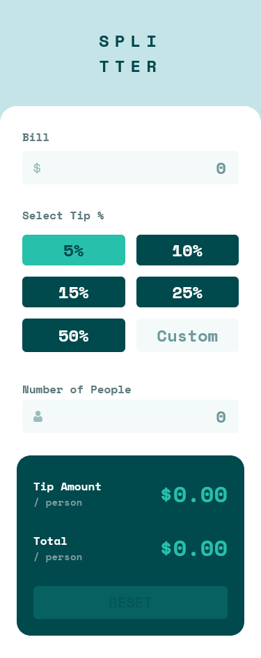

# Frontend Mentor - Tip calculator app solution

This is a solution to the [Tip calculator app challenge on Frontend Mentor](https://www.frontendmentor.io/challenges/tip-calculator-app-ugJNGbJUX). Frontend Mentor challenges help you improve your coding skills by building realistic projects.

## Table of contents

- [Frontend Mentor - Tip calculator app solution](#frontend-mentor---tip-calculator-app-solution)
  - [Table of contents](#table-of-contents)
  - [Overview](#overview)
    - [The challenge](#the-challenge)
    - [Screenshot](#screenshot)
    - [Links](#links)
  - [My process](#my-process)
    - [Built with](#built-with)
    - [What I learned](#what-i-learned)
  - [Author](#author)

## Overview

### The challenge

Users should be able to:

- View the optimal layout for the app depending on their device's screen size
- See hover states for all interactive elements on the page
- Calculate the correct tip and total cost of the bill per person

### Screenshot

### Links

- Solution URL: [GitHub repo](https://github.com/pbryan9/fm_tip_calculator)
- Live Site URL: [Netlify deploy](https://657e436ec7a0a512d8939e89--calm-capybara-1c4fe4.netlify.app/)

## My process

### Built with

- Semantic HTML5 markup
- CSS custom properties
- Flexbox
- CSS Grid
- Mobile-first workflow
- [React](https://reactjs.org/) - JS library
- [Styled Components](https://styled-components.com/) - For styles

### What I learned

I hadn't really ever done much work with Grid layout before...not that this is much of a workout on that front, but I did take a little while to go learn how grid works. I'll definitely be expanding on that start in the future -- grid's pretty good stuff for two-dimensional layouts.

## Author

- Website - [Patrick Bryan](https://pattyb.dev)
- Frontend Mentor - [@pbryan9](https://www.frontendmentor.io/profile/yourusername)
